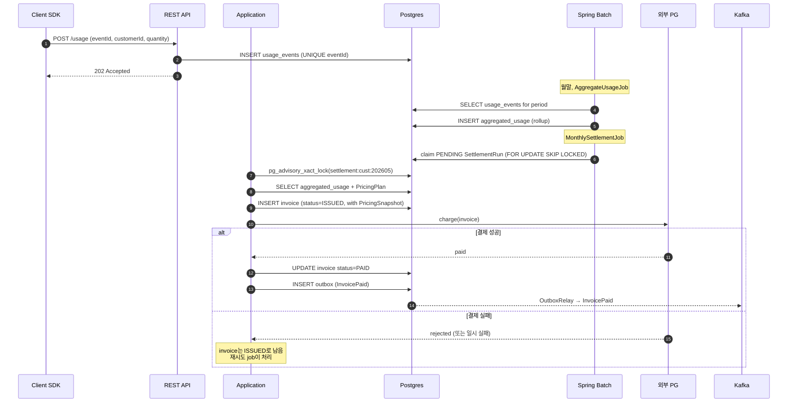
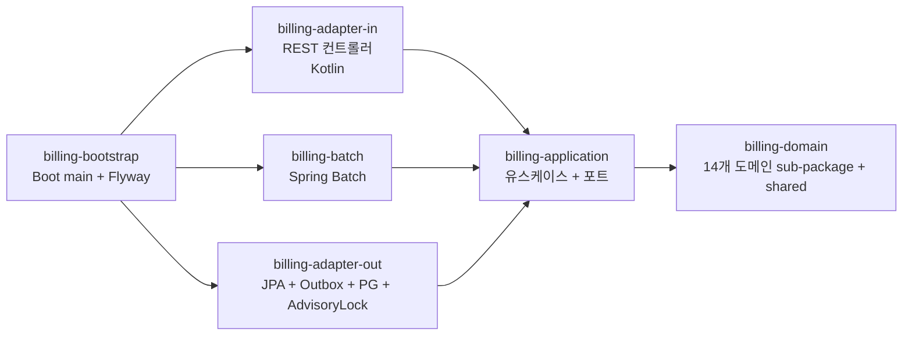
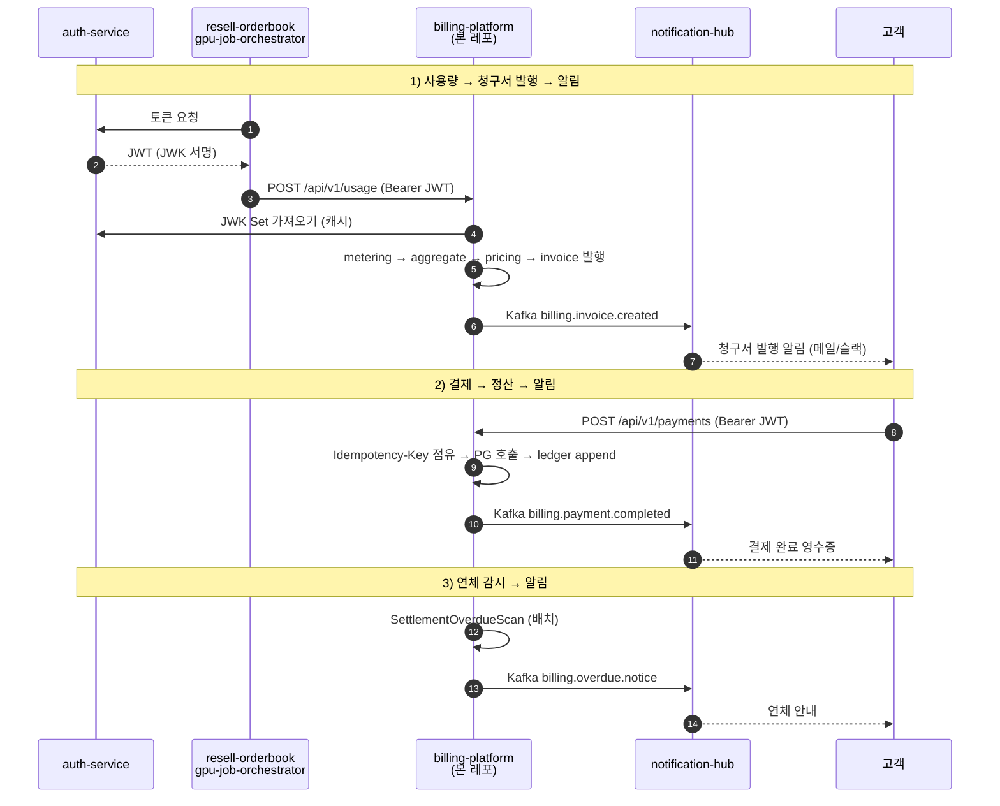

# Billing Platform

B2B SaaS의 결제 / 청구 / 정산 백엔드입니다. 두 가지 흐름을 한 시스템에서 처리합니다.

- **실시간 결제** — 사용자 지갑(Wallet) 잔액 차감, 외부 PG(결제대행사) 호출, 한 번 기록되면
  수정/삭제하지 않고 추가만 가능한 원장(append-only ledger) 에 기록
- **사용량 기반 청구** — 사용량 이벤트(UsageEvent) 수집 → 월 단위 집계 → 가격 정책 적용 →
  청구서(Invoice) 발행 → 결제 시도 → 정산 보고

선불(prepaid, 미리 충전 후 차감) 잔액 차감과 후불(postpaid, 한 달 쓴 만큼 청구) 사용량 기반
청구 두 모델을 같은 도메인 인프라 (Outbox, Idempotency, Resilience4j, Spring Batch) 위에
올렸습니다.

## 기술 스택

- **Language**: Java 21, Kotlin (adapter-in 모듈)
- **Framework**: Spring Boot 3.4, Spring Modulith, Spring Batch
- **Database**: PostgreSQL 16, H2 (local/dev)
- **Cache / KV**: Caffeine (local/dev), Redis (prod 캐시 + 멱등성 키)
- **Messaging**: Apache Kafka (Outbox + DLQ)
- **Security**: Spring Security (OAuth2 Resource Server, JWT)
- **Resilience**: Resilience4j (서킷 브레이커, 재시도)
- **Build / CI**: Gradle 8, GitHub Actions, Docker, Kubernetes

## 풀어야 할 핵심 문제

### 실시간 결제 측

- **결제 중복 방지** — 사용자가 결제 버튼을 두 번 누르거나 모바일 네트워크 단절로 재시도가
  발생해도 결제는 한 번만 처리되어야 합니다. Idempotency-Key (같은 요청이 두 번 와도 한
  번만 처리되게 막는 헤더) + Redis SETNX (키가 없을 때만 set, 있으면 실패) 로 차단합니다.
- **외부 PG 장애 격리** — PG 응답이 지연되어도 우리 측 트랜잭션이 함께 멈추지 않아야 합니다.
  Resilience4j 서킷 브레이커 (실패가 누적되면 호출 자체를 잠시 차단해서 자원을 보호하는
  장치) 로 막습니다.
- **이벤트와 DB의 원자성** — "결제 완료" 이벤트 발행과 DB 커밋이 따로 처리되면 안 됩니다.
  Outbox 패턴 (이벤트를 일단 같은 트랜잭션 안에서 DB에 적어두고 나중에 별도 워커가 메시지
  브로커로 전달) 으로 해결합니다.
- **잔액 음수 방지** — 동시 차감 요청에서 한쪽 쓰기가 다른 쪽 쓰기를 덮어쓰는 lost update
  를 `@Version` 낙관적 락 (충돌 시 예외 던지고 재시도하게 만드는 버전 컬럼) 으로 차단.

### 사용량 기반 청구 측

- **사용량 이벤트 중복 수신 방지** — 클라이언트 SDK가 재시도할 때 같은 eventId 가 두 번
  도착해도 한 번만 기록. eventId 를 PK 겸 UNIQUE 제약으로 두면 두 번째 INSERT 는 DB 가
  거절합니다.
- **월별 정산 동시 실행 방지** — 여러 인스턴스에서 같은 customer × month 정산이 동시에
  시작되지 않도록 직렬화. Postgres 의 advisory lock (이름 붙인 임의의 잠금, 트랜잭션 끝나면
  자동 해제) 인 `pg_advisory_xact_lock` 을 씁니다.
- **정산 worker 병렬 처리** — 정산 대상 row 를 워커 풀이 나눠 처리하되 같은 row 를 두 번
  잡지 않도록 `FOR UPDATE SKIP LOCKED` (이미 잠긴 row 는 건너뛰고 다음 걸 가져오는 SQL
  옵션) 사용.
- **가격 정책 변경 시 과거 청구서 보호** — Invoice 생성 시점의 가격 정책을 PricingSnapshot
  (그 시점 요금표를 그대로 보관한 값 객체) 으로 invoice 자체에 저장합니다. 요금제가 바뀌어도
  과거 청구서 금액은 변하지 않습니다.
- **결제 실패 격리** — invoice 는 발행됨(ISSUED) 상태로 남기고 별도 재시도 job 이 처리합니다.
  계속 실패하면 DLQ (Dead Letter Queue, 처리 실패한 메시지를 모아두는 별도 큐) 로 이동.
- **정산 부분 실패 허용** — Spring Batch 의 chunk + skip + retry (정해진 묶음 단위로 처리,
  실패 row 는 건너뛰고 일정 횟수까지 재시도) 로 100만 건 중 10건 실패해도 나머지는 진행.

## 핵심 설계 결정

설계 결정의 상세 배경은 [docs/adr/](docs/adr/)의 ADR 32건에 정리되어 있습니다. 빌링
도메인 특화 결정은 다음과 같습니다.

- [ADR-0013: 정산 동시성 — Postgres advisory lock](docs/adr/0013-settlement-advisory-lock.md)
- [ADR-0014: Worker pool 병렬 처리 — `FOR UPDATE SKIP LOCKED`](docs/adr/0014-skip-locked-worker-pool.md)
- [ADR-0015: 청구서의 가격 정책 snapshot](docs/adr/0015-pricing-snapshot.md)

## 사용량 → 청구 → 정산 흐름



## 모듈 구조

Spring Modulith가 모듈 간 의존 방향을 빌드 시점에 검증합니다.



도메인 sub-package:

| Package | 책임 |
|---|---|
| `wallet` | 선불 잔액 (Wallet 애그리거트) |
| `order` | 주문 |
| `payment` | 결제 (실시간) |
| `refund` | 환불 |
| `ledger` | append-only 원장 |
| `credit` | 선불/프로모션 크레딧, 만료 처리 |
| `metering` | 사용량 이벤트 (UsageEvent), 집계 결과 (AggregatedUsage) |
| `pricing` | 가격 정책 (PricingPlan, Tier, PricingSnapshot) |
| `invoice` | 청구서 (Invoice, InvoiceLine, InvoiceStatus) |
| `settlement` | 정산 실행 (SettlementRun, BillingPeriod) |
| `budget` | 예산 알림 규칙과 트리거 이력 |
| `webhook` | 고객사 webhook endpoint와 전송 상태 |
| `audit` | 운영 감사 로그 (append-only, who/when/what) |
| `shared` | Money, CustomerId, DomainEvent 등 공통 VO |

## 실행 방법

H2와 Mock PG로 외부 의존성 없이 실행할 수 있습니다.

```bash
./gradlew :billing-bootstrap:bootRun
```

### 사용량 → 청구 → 정산 한 사이클 (curl)

```bash
# 1. 사용량 이벤트 5건 전송 (1만 건 초과 → 과금 대상)
for i in $(seq 1 5); do
  curl -s -X POST http://localhost:8080/api/v1/usage \
    -H 'Content-Type: application/json' \
    -d "{
      \"eventId\":\"$(uuidgen)\",
      \"customerId\":\"acme-corp\",
      \"resourceType\":\"API_CALL\",
      \"quantity\":3000,
      \"occurredAt\":\"2026-05-15T10:00:00Z\"
    }" | jq
done

# 2. 운영자 수동 정산 트리거 (평소에는 배치가 자동 실행)
curl -s -X POST "http://localhost:8080/api/v1/settlement/run?customerId=acme-corp&period=2026-05" | jq

# 3. 발행된 청구서 확인
curl -s "http://localhost:8080/api/v1/invoices?customerId=acme-corp" | jq
```

### 실시간 결제 흐름

```bash
# 주문 생성
curl -s -X POST http://localhost:8080/api/v1/orders \
  -H 'Content-Type: application/json' \
  -H 'Idempotency-Key: order-key-001' \
  -d '{"currency":"KRW","items":[{"sku":"SKU-1","quantity":2,"unitPrice":1000}]}' | jq

# 결제 (Mock PG 자동 승인)
curl -s -X POST http://localhost:8080/api/v1/payments \
  -H 'Content-Type: application/json' \
  -H 'Idempotency-Key: pay-key-001' \
  -d '{"orderId":"<위에서 받은 id>","method":"CARD"}' | jq
```

- API 문서: <http://localhost:8080/swagger>
- 모듈 경계 진단: <http://localhost:8080/actuator/modulith>

## 테스트 및 빌드

```bash
./gradlew test                          # 전체
./gradlew :billing-domain:test          # 도메인 단위
./gradlew :billing-application:test     # application 단위
./gradlew :billing-bootstrap:bootJar    # 배포용 jar
./gradlew :billing-bootstrap:test       # Modulith verify
```

## 운영 프로필 (`prod`)

`SPRING_PROFILES_ACTIVE=prod` 일 때 활성화되는 항목입니다.

- PostgreSQL, Redis, Kafka 실제 사용
- 외부 PG 호출이 RestClientPgClient (Resilience4j 서킷 브레이커 적용) 로 동작 (local/dev 는 Mock)
- 멱등성 키 (같은 요청 두 번 처리 방지용 키) 를 Redis SETNX 로 처리 (local/dev 는 in-memory)
- `pg_advisory_xact_lock` (Postgres 의 이름 기반 트랜잭션 잠금) 활성화 (H2 미지원이라
  local/dev 는 NoOp 으로 대체)
- OAuth2 Resource Server (JWT 토큰 검증) 인증 (local/dev 는 모두 통과)
- Outbox Relay (DB 의 outbox 테이블에서 메시지를 읽어 Kafka 로 보내는 워커) 활성화
- Read-replica 라우팅 — 읽기 전용 트랜잭션은 replica 로 ([ADR-0025](docs/adr/0025-read-replica-routing.md))
- ThreadPool Bulkhead — PG / webhook / audit-export 도메인별 worker pool 격리 ([ADR-0026](docs/adr/0026-bulkhead-thread-pool-isolation.md))
- Audit log — 도메인 변경 이벤트의 append-only 기록 ([ADR-0023](docs/adr/0023-audit-log.md))

## Portfolio Set 통합

본 레포는 단독으로도 돌아가지만, 8 개 레포로 구성된 포트폴리오 묶음의 한 조각이기도 합니다.
다른 레포들이 발사한 사용량 이벤트를 받아 청구서로 만들고, 발행/결제/연체 알림을 알림
허브로 흘려보내는 위치입니다. 묶음 전체 인덱스는 프로필 README
[ssa1004/ssa1004](https://github.com/ssa1004/ssa1004) 에 있습니다.

| 레포 | 역할 | 본 레포와의 관계 |
|---|---|---|
| [auth-service](https://github.com/ssa1004/auth-service) | OIDC / JWT 발급, JWK Set 노출 | `prod` 의 OAuth2 Resource Server 가 이 JWK Set 으로 토큰 검증 |
| [security-log-search](https://github.com/ssa1004/security-log-search) | 보안 감사 로그 검색 | `audit` 도메인 append-only 로그를 SIEM 으로 export |
| [notification-hub](https://github.com/ssa1004/notification-hub) | 알림 라우팅 / 템플릿 / 발송 | invoice.created / payment.completed / overdue.notice 를 Kafka 로 수신 |
| [search-service](https://github.com/ssa1004/search-service) | 도메인 검색 (ES) | invoice 검색 인덱스의 source-of-truth 가 본 레포 |
| **billing-platform** *(본 레포)* | **결제 / 청구 / 정산** | **두 종류 usage event 를 받아 invoice 발행, 결과를 알림으로 흘림** |
| [resell-orderbook](https://github.com/ssa1004/resell-orderbook) | 리셀 거래 매칭 / 체결 | 거래 체결마다 usage event 를 본 레포로 발사 |
| [gpu-job-orchestrator](https://github.com/ssa1004/gpu-job-orchestrator) | GPU job 스케줄러 | job 완료 시 GPU 사용 시간 usage event 를 본 레포로 발사 |
| [mini-shop-observability](https://github.com/ssa1004/mini-shop-observability) | observability 플레이그라운드 | OpenTelemetry / Prometheus / Loki 셋업 참고 출처 |

### 묶음 안에서의 데이터 흐름



### 통합 데모

`docker-compose.integration.yml` 이 다른 레포 stub 3종 (auth-stub /
notification-stub / usage-producer) 과 메시지 버스 (kafka) 를 띄웁니다.
`scripts/integration-demo.sh` 가 mock JWT 발급 → usage 발사 → invoice 발행 →
결제 → notification stub 수신까지 한 사이클로 재현합니다.

```bash
# 1. stub 들 띄움
docker compose -f infrastructure/docker-compose.integration.yml up -d --wait

# 2. 옆 터미널에서 billing-platform 을 outbox-relay on + kafka 연결로 띄움
BILLING_OUTBOX_RELAY_ENABLED=true \
  SPRING_KAFKA_BOOTSTRAP_SERVERS=localhost:9092 \
  ./gradlew :billing-bootstrap:bootRun

# 3. 통합 데모 실행
scripts/integration-demo.sh

# 4. 정리
docker compose -f infrastructure/docker-compose.integration.yml down -v
```

## 향후 개선 사항

- 사용량 집계를 streaming aggregation으로 전환 (Kafka Streams) — 대용량 고객 대응
- schema-per-tenant 옵션 — 현재는 row-level (`customer_id`, [ADR-0017](docs/adr/0017-multi-tenancy-row-level.md))
- 가격 변경 알림 — 요금제 변경 시 고객에게 사전 통지하는 워크플로
- Invoice PDF 생성 + 이메일 발송
- 미수금 대시보드 자동 추심 — 현재는 조회 API ([AgedReceivablesController](billing-adapter-in/src/main/kotlin/com/example/billing/adapter/web/AgedReceivablesController.kt)) 까지
