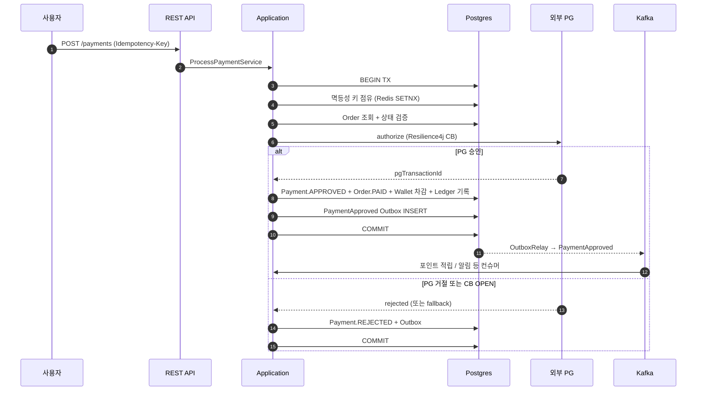
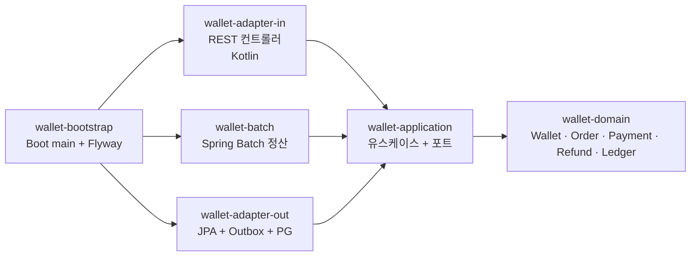

# Prepaid Wallet

선불 잔액 기반 결제 백엔드입니다. 사용자 지갑 잔액으로 결제를 처리하고, 외부 PG 또는
인앱 결제로 충전하며, append-only 원장으로 모든 거래 내역을 추적합니다.

게임 인앱 결제, SaaS 정기 결제, B2C 페이먼트 서비스에서 일반적으로 사용되는 형태입니다.

## 기술 스택

- **Language**: Java 21, Kotlin (adapter-in 모듈)
- **Framework**: Spring Boot 3.3, Spring Modulith, Spring Batch
- **Database**: PostgreSQL 16, Redis (Caffeine L1 + Redis L2 2-tier 캐시)
- **Messaging**: Apache Kafka (Outbox + DLQ)
- **Security**: Spring Security (OAuth2 Resource Server, JWT)
- **Resilience**: Resilience4j (서킷 브레이커, 재시도)
- **Build / CI**: Gradle 8, GitHub Actions, Docker, Kubernetes

## 주요 요구사항

- **결제 중복 방지**: 사용자가 결제 버튼을 두 번 누르거나 모바일 네트워크 단절로 재시도가
  발생해도 결제는 한 번만 처리되어야 합니다.
- **외부 PG 장애 격리**: PG 응답이 지연되어도 우리 측 트랜잭션이 함께 멈추지 않아야 합니다.
- **이벤트와 DB 의 원자성**: "결제 완료" 이벤트 발행과 DB 커밋이 따로 처리되어 한쪽만 성공하는
  상황이 발생하면 안 됩니다.
- **잔액 음수 방지**: 동시 차감 요청에서도 잔액이 음수가 되어서는 안 됩니다.
- **부분 실패에 강한 정산**: 야간 정산 작업 시 일부 레코드가 실패해도 전체가 중단되지 않고
  실패 건만 격리되어야 합니다.
- **잔액-원장 정합성 검증**: Wallet 잔액과 LedgerEntry 합계가 일치하는지 매일 검증합니다.

## 핵심 설계 결정

### 1. 멱등성 키 기반 중복 결제 차단

`Idempotency-Key` 헤더와 Redis SETNX 를 조합합니다. 같은 키로 재요청이 들어오면 즉시 409 를
반환하여 동일 결제가 두 번 처리되지 않습니다.

### 2. 외부 PG 장애 격리

Resilience4j 서킷 브레이커, 재시도, fallback 을 적용했습니다. CB OPEN 상태에서는 우리 측
트랜잭션을 즉시 종료하여 PG 의 long timeout 이 우리 처리에 영향을 주지 않도록 했습니다.

### 3. Outbox 패턴

DB 커밋과 Kafka 이벤트 발행의 원자성을 보장합니다. 도메인 트랜잭션 안에서 outbox 테이블에
이벤트를 INSERT 하고, 별도 OutboxRelay 가 polling 으로 미발행 건을 Kafka 로 전송합니다.
컨슈머에서 N회 실패한 메시지는 DLQ 로 격리하고, 운영자 endpoint 를 통해 replay 할 수 있습니다.

### 4. 잔액 동시성 처리 (낙관적 락)

Wallet 엔티티에 `@Version` 을 적용하여 동시 차감 요청에서 lost update 를 방지합니다. 충돌
시 OptimisticLockingFailureException 이 발생하며 호출 측에서 retry 합니다.

### 5. 부분 실패에 강한 정산 배치

Spring Batch 의 chunk + skip + retry 메커니즘을 활용했습니다. 100만 건 처리 중 10건이
실패해도 나머지는 정상 처리되며, 실패한 레코드만 별도로 격리되어 다음 라운드에서 재처리됩니다.

### 6. Append-only 원장 + 일일 정산 검증

LedgerEntry 는 append-only 로만 기록되며, 일일 정산 Job 이 Wallet.balance 와 LedgerEntry
합계를 비교하여 정합성을 검증합니다.

설계 결정의 상세 배경은 [docs/adr/](docs/adr/) 의 ADR 12건에 정리되어 있습니다.

## 결제 흐름



`ProcessPaymentService` 한 트랜잭션 안에서의 처리 순서입니다.

```
1. 멱등성 키 점유      → 같은 결제 두 번 차단 (Redis SETNX)
2. Order 조회 + 검증   → CREATED 상태일 때만 결제 가능
3. PG.authorize()      → Resilience4j 서킷 브레이커로 보호
4. 결과 분기:
   - 승인: Payment.approve → Order.markPaid → Wallet 잔액 차감
           → Ledger 기록 → PaymentApproved 이벤트 (Outbox INSERT)
   - 거절: Payment.rejected → PaymentRejected 이벤트
5. 트랜잭션 커밋       → DB 변경과 Outbox 이벤트가 원자적으로 함께 커밋
6. 별도 OutboxRelay → Kafka publish → 컨슈머가 알림/포인트 적립 등 처리
```

## 모듈 구조

Spring Modulith 가 모듈 간 의존 방향을 빌드 시점에 검증합니다.



| 모듈 | 책임 |
|---|---|
| `wallet-domain` | 순수 도메인 모델 (Wallet, Order, Payment, Refund, LedgerEntry). Spring 의존성 없음 |
| `wallet-application` | 유스케이스, 외부 포트 인터페이스 |
| `wallet-adapter-in` | REST 컨트롤러 (Kotlin), 인증, 예외 핸들러 |
| `wallet-adapter-out` | JPA, Outbox, Mock/Feign PG, 캐시, 멱등성 store |
| `wallet-batch` | 일일 정산 (Wallet 잔액과 Ledger 합계 검증) |
| `wallet-bootstrap` | Spring Boot 진입점, Flyway, Modulith 검증 |
| `e2e-tests` | Postgres Testcontainer 기반 통합 시나리오 |

## 실행 방법

H2 와 Mock PG 를 사용하여 외부 의존성 없이 실행할 수 있습니다.

```bash
./gradlew :wallet-bootstrap:bootRun
```

다른 터미널에서 호출 예시:

```bash
# 주문 생성
curl -s -X POST http://localhost:8080/api/v1/orders \
  -H 'Content-Type: application/json' \
  -H 'Idempotency-Key: order-key-001' \
  -d '{"currency":"KRW","items":[{"sku":"SKU-1","quantity":2,"unitPrice":1000}]}' | jq

# 결제 (Mock PG 자동 승인)
curl -s -X POST http://localhost:8080/api/v1/payments \
  -H 'Content-Type: application/json' \
  -H 'Idempotency-Key: pay-key-001' \
  -d '{"orderId":"<위에서 받은 id>","method":"CARD"}' | jq

# 결제 실패 시뮬레이션 (Idempotency-Key 가 FAIL_ 로 시작)
curl -s -X POST http://localhost:8080/api/v1/payments \
  -H 'Content-Type: application/json' \
  -H 'Idempotency-Key: FAIL_pay-key-002' \
  -d '{"orderId":"<주문 id>","method":"CARD"}' | jq
```

- API 문서: <http://localhost:8080/swagger>
- 모듈 경계 진단: <http://localhost:8080/actuator/modulith>

## 테스트 및 빌드

```bash
./gradlew test                        # 전체
./gradlew :wallet-domain:test         # 도메인 단위
./gradlew :wallet-bootstrap:bootJar   # 배포용 jar 생성
./gradlew :wallet-bootstrap:test      # Modulith verify
```

## 운영 프로필 (`prod`)

`SPRING_PROFILES_ACTIVE=prod` 일 때 활성화되는 항목입니다.

- PostgreSQL, Redis, Kafka 실제 사용
- 외부 PG 호출이 FeignPgClient (Resilience4j 적용) 로 동작 (dev 는 Mock)
- 멱등성 키를 Redis SETNX 로 처리 (dev 는 in-memory)
- OAuth2 Resource Server (JWT) 인증 (dev 는 모두 통과)
- Outbox Relay 활성화 → Kafka publish
