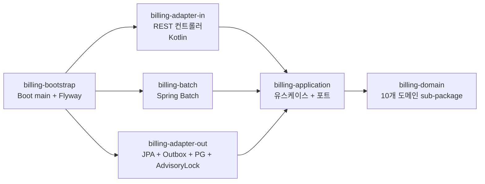

# Billing Platform

B2B SaaS 의 결제 / 청구 / 정산 백엔드입니다. 두 가지 흐름을 한 시스템에서 처리합니다.

- **실시간 결제** — 사용자 지갑(Wallet) 잔액 차감, PG 결제, append-only 원장 기록
- **사용량 기반 청구** — UsageEvent 수집 → 월 단위 집계 → 가격 정책 적용 → Invoice 발행 →
  결제 시도 → 정산 보고

선불(prepaid) 잔액 차감과 후불(postpaid) 사용량 기반 청구 두 모델을 같은 도메인 인프라
(Outbox, Idempotency, Resilience4j, Spring Batch) 위에 올렸습니다.

## 기술 스택

- **Language**: Java 21, Kotlin (adapter-in 모듈)
- **Framework**: Spring Boot 3.4, Spring Modulith, Spring Batch
- **Database**: PostgreSQL 16, Redis (Caffeine L1 + Redis L2 2-tier 캐시)
- **Messaging**: Apache Kafka (Outbox + DLQ)
- **Security**: Spring Security (OAuth2 Resource Server, JWT)
- **Resilience**: Resilience4j (서킷 브레이커, 재시도)
- **Build / CI**: Gradle 8, GitHub Actions, Docker, Kubernetes

## 풀어야 한 핵심 문제

### 실시간 결제 측

- **결제 중복 방지** — 사용자가 결제 버튼을 두 번 누르거나 모바일 네트워크 단절로 재시도가
  발생해도 결제는 한 번만 처리되어야 합니다 (Idempotency-Key + Redis SETNX).
- **외부 PG 장애 격리** — PG 응답이 지연되어도 우리 측 트랜잭션이 함께 멈추지 않아야 합니다
  (Resilience4j 서킷 브레이커).
- **이벤트와 DB 의 원자성** — "결제 완료" 이벤트 발행과 DB 커밋이 따로 처리되면 안 됩니다
  (Outbox 패턴).
- **잔액 음수 방지** — 동시 차감 요청에서 lost update 차단 (`@Version` 낙관적 락).

### 사용량 기반 청구 측

- **사용량 이벤트 중복 수신 방지** — 클라이언트 SDK 가 retry 시 같은 eventId 가 두 번
  도착해도 한 번만 기록 (eventId 가 PK + UNIQUE).
- **월별 정산 동시 실행 방지** — 여러 인스턴스에서 같은 customer × month 정산이 동시에
  시작되지 않도록 직렬화 (`pg_advisory_xact_lock`).
- **정산 worker 병렬 처리** — 정산 대상 row 를 worker pool 이 나눠 처리하되 같은 row 를
  두 번 잡지 않도록 (`FOR UPDATE SKIP LOCKED`).
- **가격 정책 변경 시 과거 청구서 보호** — Invoice 생성 시점의 PricingSnapshot 을 invoice
  자체에 박제. plan 이 바뀌어도 과거 청구서 금액 불변.
- **결제 실패 격리** — invoice 는 ISSUED 로 남고 별도 retry job 이 처리. 영구 실패는 DLQ.
- **정산 부분 실패 허용** — Spring Batch chunk + skip + retry. 100만 건 중 10건 실패해도
  나머지 진행.

## 핵심 설계 결정

설계 결정의 상세 배경은 [docs/adr/](docs/adr/) 의 ADR 15건에 정리되어 있습니다. 빌링
도메인 특화 결정은 다음과 같습니다.

- [ADR-0013: 정산 동시성 — Postgres advisory lock](docs/adr/0013-settlement-advisory-lock.md)
- [ADR-0014: Worker pool 병렬 처리 — `FOR UPDATE SKIP LOCKED`](docs/adr/0014-skip-locked-worker-pool.md)
- [ADR-0015: 청구서의 가격 정책 snapshot](docs/adr/0015-pricing-snapshot.md)

## 사용량 → 청구 → 정산 흐름


## 모듈 구조

Spring Modulith 가 모듈 간 의존 방향을 빌드 시점에 검증합니다.



도메인 sub-package:

| Package | 책임 |
|---|---|
| `wallet` | 선불 잔액 (Wallet 애그리거트) |
| `order` | 주문 |
| `payment` | 결제 (실시간) |
| `refund` | 환불 |
| `ledger` | append-only 원장 |
| `metering` | 사용량 이벤트 (UsageEvent), 집계 결과 (AggregatedUsage) |
| `pricing` | 가격 정책 (PricingPlan, Tier, PricingSnapshot) |
| `invoice` | 청구서 (Invoice, InvoiceLine, InvoiceStatus) |
| `settlement` | 정산 실행 (SettlementRun, BillingPeriod) |
| `shared` | Money, CustomerId, DomainEvent 등 공통 VO |

## 실행 방법

H2 와 Mock PG 로 외부 의존성 없이 실행할 수 있습니다.

```bash
./gradlew :billing-bootstrap:bootRun
```

### 사용량 → 청구 → 정산 한 사이클 (curl)

```bash
# 1. 사용량 이벤트 5건 전송 (1만 건 초과 → 과금 대상)
for i in $(seq 1 5); do
  curl -s -X POST http://localhost:8080/api/v1/usage \
    -H 'Content-Type: application/json' \
    -d "{
      \"eventId\":\"$(uuidgen)\",
      \"customerId\":\"acme-corp\",
      \"resourceType\":\"API_CALL\",
      \"quantity\":3000,
      \"occurredAt\":\"2026-05-15T10:00:00Z\"
    }" | jq
done

# 2. 운영자 수동 정산 트리거 (평소엔 batch 가 자동)
curl -s -X POST "http://localhost:8080/api/v1/settlement/run?customerId=acme-corp&period=2026-05" | jq

# 3. 발행된 청구서 확인
curl -s "http://localhost:8080/api/v1/invoices?customerId=acme-corp" | jq
```

### 실시간 결제 흐름

```bash
# 주문 생성
curl -s -X POST http://localhost:8080/api/v1/orders \
  -H 'Content-Type: application/json' \
  -H 'Idempotency-Key: order-key-001' \
  -d '{"currency":"KRW","items":[{"sku":"SKU-1","quantity":2,"unitPrice":1000}]}' | jq

# 결제 (Mock PG 자동 승인)
curl -s -X POST http://localhost:8080/api/v1/payments \
  -H 'Content-Type: application/json' \
  -H 'Idempotency-Key: pay-key-001' \
  -d '{"orderId":"<위에서 받은 id>","method":"CARD"}' | jq
```

- API 문서: <http://localhost:8080/swagger>
- 모듈 경계 진단: <http://localhost:8080/actuator/modulith>

## 테스트 및 빌드

```bash
./gradlew test                          # 전체
./gradlew :billing-domain:test          # 도메인 단위
./gradlew :billing-application:test     # application 단위
./gradlew :billing-bootstrap:bootJar    # 배포용 jar
./gradlew :billing-bootstrap:test       # Modulith verify
```

## 운영 프로필 (`prod`)

`SPRING_PROFILES_ACTIVE=prod` 일 때 활성화되는 항목입니다.

- PostgreSQL, Redis, Kafka 실제 사용
- 외부 PG 호출이 FeignPgClient (Resilience4j 적용) 로 동작 (dev 는 Mock)
- 멱등성 키를 Redis SETNX 로 처리 (dev 는 in-memory)
- `pg_advisory_xact_lock` 활성화 (H2 미지원이라 dev 는 NoOp)
- OAuth2 Resource Server (JWT) 인증 (dev 는 모두 통과)
- Outbox Relay 활성화 → Kafka publish

## 향후 개선 사항

- 사용량 집계를 streaming aggregation 으로 (Kafka Streams) — 대용량 customer 대응
- 멀티테넌시 — schema-per-tenant vs row-level (현재는 row-level + customer_id)
- 가격 변경 알림 — plan 변경 시 customer 에게 사전 통지 워크플로
- Invoice PDF 생성 + 이메일 발송
- 미수금 dashboard + 자동 collection 워크플로
